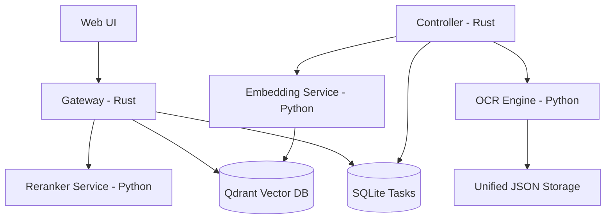

# OCRLLM: 高质量多语言 OCR 与 RAG 系统


OCRLLM 是一个专为处理中、日、英多语言文档设计的端到端 RAG (Retrieval-Augmented Generation) 系统。它结合了 Rust 的高性能任务调度、Python 的深度学习处理能力以及 Qwen3.5 大模型的推理能力。

## 🌟 核心特性

- **多轨道 OCR 引擎**: 支持基于 `pdfplumber` 的精确坐标提取与段落聚合。
- **高性能数据管道**: 基于 Rust 处理文本清洗、异体字规范化与切片 (Chunking)。
- **双阶段检索架构**: 
  - **粗排**: 基于 Qdrant 矢量数据库的余弦相似度检索。
  - **精排**: 基于 Cross-Encoder 的语义重排 (Reranking)，显著提升结果质量。
- **Qwen3.5 LLM 驱动**: 针对中日文场景优化的回答生成。
- **全链路追踪**: 基于 SQLite 的显式状态机管理 PDF 解析状态。

---

## 🛠️ 部署指南

### 1. 环境依赖

- **操作系统**: Windows 10/11, Linux, macOS。
- **基础工具**:
  - [Rust](https://rustup.rs/) (edition 2024)
  - [Python 3.10+](https://www.python.org/)
  - [Docker Desktop](https://www.docker.com/products/docker-desktop/) (用于运行 Qdrant 和 vLLM)

### 2. 基础设施启动

使用 Docker 启动核心存储与推理组件：

```powershell
docker compose up -d qdrant
```
*注意：若需启动本地 LLM 推理 (vLLM)，需具备 NVIDIA GPU 环境并运行 `docker compose up -d vllm`。*

### 3. 后端服务启动 (Python)

建议在虚拟环境中安装依赖：

```powershell
# 安装依赖
pip install -r services/requirements.txt

# 启动各核心服务 (多终端运行)
python services/ocr-engine/main.py     # Port 8000
python services/model-runner/main.py   # Port 8002
python services/embed-service/main.py   # Port 8003
python services/rerank-service/main.py  # Port 8004
```

### 4. 核心应用启动 (Rust)

```powershell
# 启动任务主控 (负责流程自动化)
cargo run -p controller

# 启动 API 服务网关与 UI
cargo run -p gateway
```
*网关启动后，访问 `http://127.0.0.1:7070` 进入 Web UI。*

---

## 🧪 自动化测试

项目内置了完整的冒烟测试与单元测试：

```powershell
# 运行 Rust 核心逻辑与序列化测试
cargo test --workspace

# 运行存储层(SQLite/Qdrant)冒烟测试
cargo test -p gateway --test storage_smoke

# 运行 Python 引擎逻辑测试
pytest services/ocr-engine/tests/test_logic.py
```

---

## 🏗️ 项目架构



---

## ⚖️ 结果选取逻辑 (Retrieval Invariants)

1. **向量召回**: 过滤 `top_k * 4` 的候选片段。
2. **重排提升**: 利用 `Cross-Encoder` 重新计算 Query 与 Chunk 的语义分数，防止向量空间聚集导致的误判。
3. **上下文限制**: 仅选取评分最高的 `top_k` 片段投喂给 LLM，并在回答中强制要求添加来源引用。
